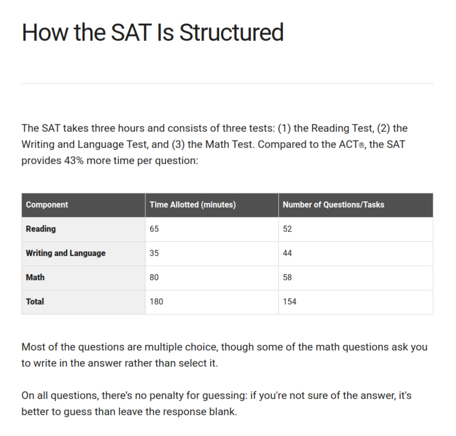

# How to study for the SATs - Guide, Tips and Tricks

If you're planning to take the SAT, you're probably feeling a mix of excitement and anxiety (realistically more anxious than excited). On one hand, the SAT is an important part of the college admissions process and can open doors to new opportunities. On the other hand, studying for the SAT can be overwhelming and stressful. But don't worry - with the right mindset and study techniques, you can conquer the SAT and achieve your desired goals. In this blog post, I’ll provide you with some tips and strategies to help you study for the SAT effectively and efficiently.

<!-- truncate -->

## Familiarize yourself with the test

For additional information, check this out: [https://satsuite.collegeboard.org/sat/whats-on-the-test/structure](https://satsuite.collegeboard.org/sat/whats-on-the-test/structure)

To familiarize yourself with the SAT test, you should take the time to:

1. Review the SAT format: Familiarize yourself with the overall format of the test, including the number of sections, the types of questions, and the time limits. Understand that the SAT has four sections: Reading, Writing and Language, Math (with a calculator), and Math (without a calculator).
2. Study the SAT content: Review the types of questions you will encounter in each section. You should know the content areas that are covered in each section and the skills and concepts you'll need to master to do well on the test.
3. Practice with official SAT materials: Practice with official SAT practice tests and sample questions to get a sense of what the actual test will be like. This will help you identify your strengths and weaknesses and focus your study efforts.
4. Understand scoring: Get familiar with how the SAT is scored, including the scoring scale and how points are awarded for correct and incorrect answers. Knowing the scoring system will help you better manage your time during the exam.
5. Get familiar with test day procedures: Review the test day procedures, including what to bring, what to expect when you arrive at the testing center, and how the test is administered. This will help you feel more comfortable and confident on test day.

## Create a Study Plan

Here are some additional details that can be added to each step of creating a study plan:

1. Assess your current knowledge: Before creating a study plan, it's essential to evaluate your current knowledge of the subject matter. Review the test format and content, and identify areas that you feel confident in and those that need more work. Use this information to create a study plan that targets your weaker areas.
2. Set specific goals: When setting goals for each study session, be specific about what you want to accomplish. Instead of setting vague goals like "study math," set specific goals like "practice 20 algebra problems" or "review the Pythagorean theorem."
3. Prioritize your time: It's crucial to prioritize your study time and focus on the areas that will have the most significant impact on your test score. Allocate more time to the sections of the test that you struggle with the most, but don't neglect the sections you're already strong in.
4. Plan breaks: Taking breaks is just as important as studying. Schedule short breaks between study sessions to give your brain time to rest and recharge. Consider taking a longer break every few hours to prevent burnout.
5. Use practice tests: Practice tests are a valuable tool for gauging your progress and identifying areas that need more work. Use practice tests to simulate the test-taking experience and measure your performance.
6. Review regularly: Reviewing material regularly is crucial for retaining information. Schedule regular review sessions to reinforce what you've learned and to help you identify areas that may need further study.
7. Be flexible: Your study plan should be flexible enough to accommodate changes in your schedule or unexpected events. Don't be too rigid with your plan, and be willing to adjust it as needed.

By following these additional details, you can create a study plan that is personalized, effective, and flexible enough to help you achieve your study goals.

## Use High-Quality Study Materials

1. Choose reputable sources: Choose study materials from reputable sources such as the College Board or other trusted publishers. These materials are designed to match the format and difficulty level of the actual test.
2. Consider online resources: There are many online resources available to help you prepare for the SAT. Khan Academy offers free SAT prep courses that cover all sections of the test. You can also use online flashcards, study guides, or video resources to supplement your studying.
3. Use practice tests: Practice tests are a great way to get familiar with the SAT format and difficulty level. Use official practice tests from the College Board or other trusted sources. Taking practice tests can also help you identify your strengths and weaknesses, so you can focus your studies on areas that need improvement.
4. Don't rely solely on study materials: While study materials are helpful, they should not be your only source of preparation. It's important to also practice your test-taking skills by timing yourself and taking practice tests under realistic conditions. Additionally, consider seeking help from a tutor or teacher if you are struggling with certain concepts.

Don't be afraid to ask for help or seek additional resources if you need them. Talk to your teachers, guidance counselor, or tutor if you're struggling with a specific topic. There are also many online communities and forums where you can connect with other students preparing for the SAT and share study tips and advice.

By following these tips and tricks, you can prepare effectively for the SAT and give yourself the best chance of success. Remember, preparation is key!

## Practice, Practice, Practice

One of the best ways to prepare for the SAT is to practice taking the test. Make use of practice tests and other materials to get plenty of practice with the types of questions you'll encounter on the actual test.

Taking practice tests will help you identify areas where you need improvement and give you a sense of what to expect on test day. It's important to simulate test-taking conditions as closely as possible, so try to take practice tests under timed conditions.

When reviewing your practice test results, focus on the questions you got wrong or struggled with. Look for patterns in your mistakes and aim to improve your understanding of those topics before test day.

## Get Plenty of Rest

1. Develop a sleep routine: Develop a regular sleep routine in the weeks leading up to the test to ensure you are well-rested. Go to bed at the same time every night and wake up at the same time every morning. This will help regulate your body clock and improve the quality of your sleep.
2. Avoid caffeine and other stimulants: Caffeine can interfere with your ability to fall asleep, so avoid consuming caffeine or other stimulants, such as energy drinks or soda, in the evening or late afternoon. Instead, choose herbal tea or water.
3. Create a relaxing environment: Ensure that your bedroom is conducive to sleep. Keep the temperature cool, reduce noise and light, and avoid using electronic devices in bed.
4. Take breaks from studying: Over-studying can increase stress and anxiety levels, which can negatively impact sleep quality. Take regular breaks from studying to rest and recharge your mind and body.
5. Eat a balanced diet: A balanced diet can help keep your body and mind healthy, and this can lead to better sleep. Avoid eating heavy meals or junk food before bed as this can disrupt sleep.

By following these steps, you can ensure that you are well-rested and in good health for the SAT test day, which can improve your ability to focus and perform well on the exam.

Preparing for the SAT can be a daunting task, but with the right mindset and study techniques, you can conquer the test and achieve your desired results. By familiarizing yourself with the test format, creating a personalized study plan, and using high-quality study materials, you can set yourself up for success. Remember, it's important to stay motivated, take breaks when needed, and seek help if you're struggling with specific concepts. With dedication and hard work, you can tackle the SAT and take the first step toward your academic goals. Good luck!

**Mentions:**

[https://www.khanacademy.org/](https://www.khanacademy.org/)
[https://www.kaptest.com/study/sat/how-to-study-for-the-sat-in-3-months/](https://www.kaptest.com/study/sat/how-to-study-for-the-sat-in-3-months/)
[https://www.kaptest.com/study/sat/5-must-know-sat-writing-tips/](https://www.kaptest.com/study/sat/5-must-know-sat-writing-tips/)
[https://www.kaptest.com/study/sat/whats-tested-on-the-sat-essay-section/](https://www.kaptest.com/study/sat/whats-tested-on-the-sat-essay-section/)
[https://www.kaptest.com/study/sat/sat-math-topics-what-to-know/](https://www.kaptest.com/study/sat/sat-math-topics-what-to-know/)
[https://www.kaptest.com/study/sat/whats-tested-on-the-sat-reading-and-writing-section/](https://www.kaptest.com/study/sat/whats-tested-on-the-sat-reading-and-writing-section/)
[https://www.kaptest.com/study/sat/whats-the-best-sat-prep-for-your-child/](https://www.kaptest.com/study/sat/whats-the-best-sat-prep-for-your-child/)
[https://satsuite.collegeboard.org/media/pdf/official-sat-study-guide-command-evidence.pdf](https://satsuite.collegeboard.org/media/pdf/official-sat-study-guide-command-evidence.pdf)
[https://www.varsitytutors.com/tutors](https://www.varsitytutors.com/tutors)
[https://blog.prepscholar.com/sat-vocabulary-words](https://blog.prepscholar.com/sat-vocabulary-words)
[https://satsuite.collegeboard.org/sat/practice-preparation/practice-tests/assistive-technology](https://satsuite.collegeboard.org/sat/practice-preparation/practice-tests/assistive-technology)